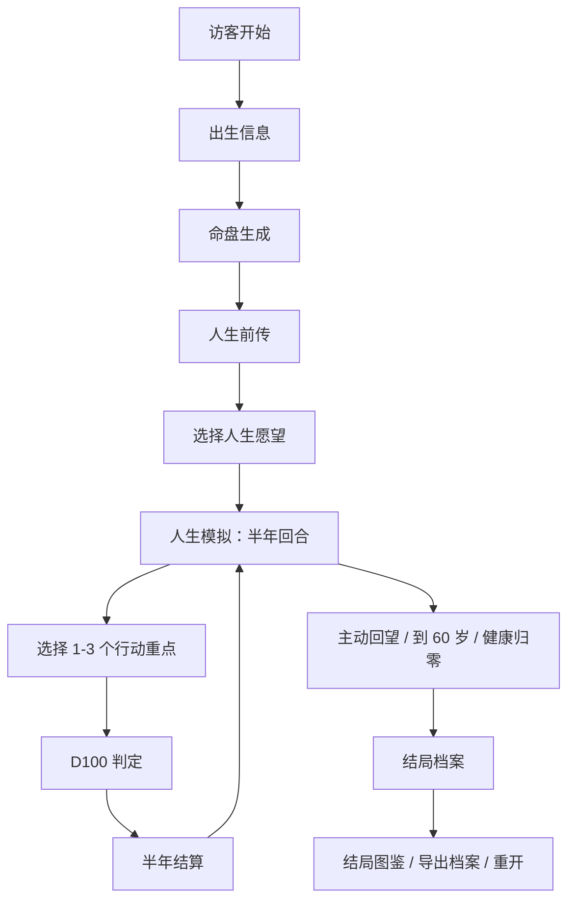

# 《一命千途》前端重设计原型简报

> 目标：这份文档用于重新设计前端原型。它不绑定当前 HTML/CSS 实现，而是总结游戏要表达什么、每个阶段要展示什么、玩家需要做什么决策，以及新前端应该如何组织信息层级。

## 1. 项目一句话总结

《一命千途》是一款结合 **八字命盘 / 大运流年 / 人生愿望 / 半年行动选择 / D100 判定 / 长期系统 / 多周目结局图鉴** 的文字人生模拟游戏。

核心表达：

> 命盘提供人生底色，选择改变人生路径。

玩家输入出生信息生成命盘，然后从指定年龄开始，每半年选择 1 到 3 个行动重点。系统结合命盘时势、年龄阶段、人生愿望和 D100 判定，推进人生状态、叙事、成就、里程碑和最终结局。

---

## 2. 前端设计总目标

新版前端应该优先解决三个体验问题：

1. **读得懂**  
   命理术语很多，但玩家应该先理解“这对游戏有什么影响”，而不是被专业词汇压住。

2. **知道该点什么**  
   每个阶段都要明确当前任务：填信息、看命盘、选愿望、选半年行动、读结算、导出/重开。

3. **像游戏，而不只是文本日志**  
   半年行动应该有“选择 → 掷骰 → 结算 → 新局面”的节奏感，关键变化应该被卡片化展示。

---

## 3. 建议视觉方向

### 3.1 推荐风格：现代命书 / 档案式人生模拟

关键词：

- 古籍纸张质感
- 命盘图表感
- 人生档案感
- 低饱和暖色
- 少量朱红/金色强调
- 有“卷宗”“命书”“人生节点”的仪式感

建议避免：

- 过度玄学化导致信息难读
- 太多装饰边框影响阅读
- 紫色渐变、通用 SaaS 卡片感
- 所有信息同时铺满屏幕

### 3.2 推荐色彩

| 用途 | 建议颜色 | 说明 |
|---|---|---|
| 主背景 | 深墨黑 / 暖棕黑 | 营造命书舞台感 |
| 内容纸面 | 米白 / 旧纸黄 | 长文本阅读舒适 |
| 主行动 | 朱红 / 暖橙红 | 确认、推进、关键选择 |
| 成功/契合 | 墨绿 / 玉色 | 愿望契合、推荐行动 |
| 成就/结局 | 金色 | 稀有结果、图鉴进度 |
| 风险/警告 | 暗红 | 回望一生、健康归零、风险提醒 |
| 次级文本 | 灰棕 | 解释、摘要、注释 |

### 3.3 字体建议

- 标题：可用宋体/楷体气质的中文字体，强调命书感。
- 正文：优先可读性，使用清晰中文无衬线或系统中文字体。
- 数字/D100/年份：可以使用略带仪表感的等宽或半等宽字体。

---

## 4. 玩家完整流程



---

## 5. 信息架构总览

新版前端建议拆成 6 个主界面：

1. **登录 / 入口页**
2. **出生信息页**
3. **命盘页**
4. **人生前传 + 愿望选择页**
5. **人生模拟页**
6. **结局档案 / 图鉴页**

此外还有 4 类全局能力：

- 设置菜单
- 可选 AI 增强配置
- 导出人生档案
- 直播/旁观人生观测页

---

## 6. 全局导航与状态

### 6.1 顶部全局栏需要展示

| 内容 | 说明 | 优先级 |
|---|---|---|
| 游戏名：一命千途 | 品牌识别 | 高 |
| 当前阶段 | 出生信息 / 命盘已成 / 前传已成 / 人生模拟 / 结局 | 高 |
| 图鉴进度 | 例如 `图鉴 3/13` | 中 |
| 状态栏开关 | 展开/收起人生状态 | 中 |
| 设置菜单 | 包含 AI、导出、回望、重开、登出 | 中 |

### 6.2 设置菜单内容

| 项目 | 展示文案 | 备注 |
|---|---|---|
| AI 设置 | 可选 AI 增强 | 不要让玩家误以为必须配置 |
| 导出档案 | 导出人生档案 | 生成命盘后可用 |
| 回望一生 | 回望一生 | 仅人生模拟阶段可用，高风险操作 |
| 重开 | 重开本局 | 二次确认更好 |
| 登出 | 登出 | 返回入口 |

---

## 7. 页面一：入口页

### 7.1 页面目标

让玩家理解游戏概念，并无压力进入。

### 7.2 必须展示

- 游戏名：一命千途
- 副标题：命盘提供底色，选择改变路径
- 一段简短介绍：输入出生信息，生成命盘和人生前传，每半年选择行动，看看人生走向何处。
- 主按钮：访客开始
- 可选提示：无需账号，本地试玩

### 7.3 设计建议

- 使用大标题和留白，营造仪式感。
- 背景可以有淡淡天干地支纹理，但不要影响文字。
- 不要在入口页放复杂规则。

---

## 8. 页面二：出生信息页

### 8.1 页面目标

收集排盘和游戏开局所需信息。

### 8.2 表单字段

| 字段 | 控件 | 说明 |
|---|---|---|
| 出生日期 | date input | 必填 |
| 日历类型 | select | 当前主要是公历，农历可置灰 |
| 出生时间 | time input | 可被“不知道时辰”关闭 |
| 不知道时辰 | checkbox | 开启三柱模式 |
| 性别 | select | 男 / 女 / 不透露 |
| 开始年龄 | number input | 6 到 60 岁 |
| 出生地 | text input | 默认 Asia/Shanghai |
| 快捷年龄 | button chips | 6、8、12、16、18、22、30、40、50 |

### 8.3 需要解释的新手内容

- 命盘只是人生底色，不会锁死人生。
- 开始年龄决定你从哪个人生阶段开始玩。
- 不知道时辰也可以玩，但命盘会变成三柱模式。
- 后续会先生成命盘，再生成前传，再进入人生模拟。

### 8.4 主要行动

- 主按钮：生成命盘

---

## 9. 页面三：命盘页

### 9.1 页面目标

让玩家看到“命盘给了什么底色”，但不要要求玩家精通八字。

### 9.2 必须展示的信息

#### A. 四柱命盘

| 字段 | 展示方式 |
|---|---|
| 年柱 | 大字卡片 |
| 月柱 | 大字卡片 |
| 日柱 | 大字卡片，强调日主 |
| 时柱 | 若未知，显示“未知时柱 / 三柱模式” |
| 日主 | 单独突出，例如“壬水” |
| 身势 | 中和 / 偏强 / 偏弱等 |

#### B. 五行分布

展示：木、火、土、金、水。

建议用：

- 条形图
- 环形图
- 五行雷达图
- 颜色分段卡片

#### C. 喜忌与关键词

| 内容 | 示例 |
|---|---|
| 喜用 | 水、金 |
| 忌讳 | 火、土 |
| 命盘标签 | 土气显、火气弱、身势中和 |

#### D. 命盘分析字段

| 字段 | 含义 |
|---|---|
| life_topics | 人生课题 |
| suitable_directions | 适合方向 |
| high_risk_fields | 高风险领域 |
| ten_god_focus | 十神重点 |
| luck_cycle_themes | 大运主题 |

#### E. 大运时间轴

每段展示：

- 年龄范围
- 干支
- 主题
- 机会
- 风险

### 9.3 主要行动

- 主按钮：生成人生前传
- 次按钮：重新输入出生信息

### 9.4 设计建议

命盘页不应变成一堆玄学表格。建议分成：

1. 顶部：你的命盘一句话总结
2. 中部：四柱 + 五行
3. 下部：大运时间轴
4. 侧边/折叠区：专业术语解释

---

## 10. 页面四：人生前传 + 愿望选择页

### 10.1 页面目标

让玩家理解“开局前发生过什么”，并选择本周目的人生愿望。

### 10.2 前传需要展示

| 内容 | 说明 |
|---|---|
| 前传正文 | 根据命盘和开始年龄生成的人生背景 |
| 性格底色 | 标签化展示，例如敏感、稳重、好奇 |
| 早年关键事件 | 卡片列表，每条包含年龄段和事件 |
| 初始资源/课题 | 可选展示，用来解释开局状态 |

### 10.3 人生愿望选择

当前愿望模板：

| 愿望 | 玩家含义 | 支持行动 |
|---|---|---|
| 稳定富足 | 物质余量、稳定生活、安全感 | 投资理财、发展事业、调养身体、陪伴家人 |
| 事业有成 | 专业成果、被看见、长期投入 | 专注学业、发展事业、社交拓展、创业冒险 |
| 亲密圆满 | 家庭、伴侣、朋友与稳定连接 | 经营感情、陪伴家人、社交拓展、调养身体 |
| 身心安稳 | 健康、情绪、精神余量 | 调养身体、随缘而行、陪伴家人、搬迁远行 |
| 自由探索 | 迁移、社交、冒险、生活半径 | 搬迁远行、社交拓展、创业冒险、随缘而行 |

### 10.4 愿望卡片应展示

- 愿望标题
- 一句话说明
- 初始进度：例如 `48/72`
- 当前状态：偏离目标 / 仍在积累 / 稳步推进 / 接近达成
- 支持行动
- 是否推荐给当前阶段

### 10.5 主要行动

- 主按钮：开始一命千途
- 次按钮：重新生成前传
- 愿望按钮：选这个愿望 / 已选择

### 10.6 重要设计要求

人生愿望是核心机制，不能埋在普通正文下面。建议把愿望选择做成独立大区：

> “选择你这一生最想追求的东西。”

并明确提示：

> 这个愿望会影响每半年评价、行动推荐和最终结局。

---

## 11. 页面五：人生模拟页

这是最重要的页面。

### 11.1 页面目标

让玩家完成循环：

> 看当前人生局面 → 选本半年重点 → 看 D100 → 读半年结算 → 决定下一步。

### 11.2 推荐布局

桌面端建议：

```text
┌──────────────────────────────────────────────┐
│ 顶部栏：阶段 / 图鉴 / 状态 / 设置             │
├──────┬───────────────────────────────────────┤
│ 状态 │ 主内容区                               │
│ 收起 │ 1. 当前局面摘要                         │
│ 后   │ 2. 半年结算卡                           │
│ 为轨 │ 3. 叙事阅读区                           │
├──────┴───────────────────────────────────────┤
│ 底部行动区：推荐行动 / 输入 / 确认 / 预览      │
└──────────────────────────────────────────────┘
```

移动端建议：

```text
顶部栏
主内容区：当前局面 / 结算 / 叙事
底部行动区：推荐3个 + 更多 + 输入 + 确认
状态面板默认收起为抽屉
```

### 11.3 人生模拟页需要展示的模块

#### A. 当前年份/年龄条

字段：

- 当前年龄
- 当前年份
- 人生阶段
- 当前半年：上半年 / 下半年
- 当前大运
- 当前流年

#### B. 本半年决策提示

内容：

| 模块 | 展示内容 |
|---|---|
| 目标 | 当前人生愿望 + 进度百分比 |
| 时势 | 大运 / 流年 |
| 流月机会 | 本半年机会摘要 |
| 风险提醒 | 本半年风险摘要 |
| 连续投入 | 当前连续行动和 D100 加成 |

#### C. 第一回合引导

仅在第一次进入人生模拟且尚未行动时显示。

展示：

- “第一次半年度选择”
- 三步提示：看愿望 → 选重点 → 看结算
- 推荐 3 个行动卡
- “我知道了”关闭按钮

#### D. 流月摘要

默认折叠，只显示：

- 本半年包含的月份
- 机会摘要
- 风险摘要
- 展开按钮：展开 6 个月

展开后显示 6 张流月卡：

| 字段 | 说明 |
|---|---|
| 月名 | 例如 正月 / 二月 |
| 干支 | 例如 甲寅 |
| 主题 | 本月主题 |
| 机会 | 适合抓住什么 |
| 风险 | 避免什么 |

#### E. 叙事阅读区

需要展示 `display_history`。

分类：

- 全部
- 判定
- 阶段
- 总结
- 成就
- 结局
- 系统

建议：

- 默认只看最近若干条。
- 支持展开全部。
- 每类叙事用不同左侧色条或图标。
- 最新结果应该自动滚到可见区域，但用户主动滚动时不要抢滚动。

#### F. 半年结算卡

每次行动后应该出现，优先显示在叙事区上方。

需要展示：

| 内容 | 示例 |
|---|---|
| 回合 | 22 岁上半年 |
| 主行动 | 专注学业 |
| D100 | 投掷 42 / 目标 64 |
| 结果 | 成功 / 失败 / 大成功 / 大失败 |
| 关键事件 | 本半年最重要的事件摘要 |
| 状态变化 | 学识 +5、压力 +2、社交 -1 |
| 人生愿望进度 | 事业有成 · 63%（+4） |
| 新成就 | 初次成功、目标同频等 |
| 下一步建议 | 推荐下个半年考虑的行动 |

### 11.4 底部行动区

#### 必须展示

- 推荐行动 Top 3
- 更多行动入口
- 自由输入框
- 加入重点按钮
- 确认本半年选择按钮
- 行动预览卡

#### 行动选项

行动选项随年龄阶段变化，但可能包含：

- 专注学业
- 发展事业
- 经营感情
- 陪伴家人
- 投资理财
- 调养身体
- 社交拓展
- 创业冒险
- 搬迁远行
- 随缘而行

#### 行动预览卡需要展示

| 字段 | 说明 |
|---|---|
| 推荐/已选行动 | 行动名 |
| 愿望契合 | 高度契合 / 间接助力 / 需要权衡 / 中性探索 |
| 预计成功率 | D100 目标值，例如 64% |
| 主要收益 | 主属性、副属性 |
| 主要风险 | 风险属性/机会成本 |
| 为什么推荐 | 与愿望、阶段、时势的关系 |
| 连续投入 | 连续次数、D100 加成 |
| 本次组合 | 已选 1 到 3 个重点 |

#### 交互规则

- 默认只显示 Top 3 推荐行动。
- 点击 `更多行动` 后展开完整行动列表。
- 自由输入不应立即提交，而是先加入本次重点。
- 最多选择 3 个行动重点。
- 主按钮只有一个：`确认本半年选择`。

---

## 12. 侧边状态栏

状态栏不是主线阅读内容，应默认可收起。

### 12.1 状态栏内容

#### A. 命盘简况

- 日主
- 四柱模式 / 三柱模式
- 命盘标签

#### B. 人生愿望

- 愿望标题
- 当前状态
- 进度条
- 分数/阈值
- 简短说明

#### C. 连续选择反馈

- 当前连续行动
- 连续次数
- D100 加成
- 机会成本提示

#### D. 长期系统

系统：

- 关系网络
- 学业/职业
- 资产基础

每个展示：

- 分数
- 趋势
- 阶段文案

#### E. 关系网络

每个关系：

- 名称
- 类型
- 状态
- 亲密度分数

#### F. 成就与里程碑

- 最近成就
- 最近人生里程碑

#### G. 基础属性

属性列表：

- 健康
- 心智
- 情绪
- 学识
- 事业
- 财富
- 家庭
- 感情
- 社交
- 名望
- 福德
- 压力

建议：

- 不要把 12 个属性全部常驻在主界面。
- 状态栏内可以用小条形图、分组、折叠。
- 压力使用反向警戒色，避免和其他正向属性混淆。

---

## 13. 结局页 / 人生档案

### 13.1 触发方式

- 到 60 岁
- 健康归零
- 主动回望一生

### 13.2 结局档案展示内容

| 内容 | 说明 |
|---|---|
| 结局标题 | 人生最终归档名 |
| 收束方式 | 主动回望 / 健康归零 / 六十岁终章 / 自然收束 |
| 结局摘要 | 一段总结 |
| 人生愿望 | 是否达成、分数、状态 |
| 维度评分 | 事业、财富、家庭、感情、健康、精神、名望等 |
| 主要成就 | 列表 |
| 主要遗憾 | 列表 |
| 关键转折 | 列表 |
| 解锁成就 | 本周目新增成就 |
| 隐藏结局 | 如果达成，突出展示 |
| 关系/长期系统 | 最终状态 |
| 里程碑 | 关键节点回顾 |

### 13.3 主要行动

- 导出人生档案
- 查看结局图鉴
- 重开一局

---

## 14. 结局图鉴

### 14.1 页面/弹窗目标

鼓励多周目探索。

### 14.2 展示内容

- 收集进度：例如 3/13
- 最新解锁
- 图鉴卡片列表

### 14.3 图鉴卡片

已解锁：

- 稀有度
- 分类
- 结局标题
- 结局描述
- 解锁次数
- 首次解锁时间

未解锁：

- 未解锁标题
- 模糊线索
- 稀有度/分类可部分隐藏

---

## 15. 可选 AI 增强配置

### 15.1 入口

放在设置菜单中，文案为：`可选 AI 增强`。

### 15.2 需要展示

- 配置档案列表
- 新增配置
- 配置名称
- API Key
- Base URL
- 模型名
- 是否启用
- 测试连接
- 设为默认
- 保存配置
- 清除 Key
- 删除配置

### 15.3 文案原则

需要明确：

- 不配置也能玩。
- 配置后用于增强命盘分析、前传、阶段叙事、半年度总结。
- Key 不会显示在游戏状态中。

---

## 16. 人生观测页 `/live.html`

### 16.1 页面目标

旁观最近活跃玩家的公开人生轨迹。

### 16.2 展示内容

- 玩家列表
- 当前阶段
- 当前年龄/年份
- 当前状态摘要
- 公开叙事记录
- 最新事件

### 16.3 注意

观测页只应展示公开投影状态，不展示内部历史、私密输入、API Key 或调试字段。

---

## 17. 前端需要消费的核心状态字段

### 17.1 阶段控制

| 字段 | 用途 |
|---|---|
| phase | 控制当前页面阶段 |
| is_processing | 展示加载/推演中 |
| is_finished | 禁用行动 |

阶段枚举：

- birth_input
- chart_ready
- prelude_ready
- life_simulation
- ending

### 17.2 命盘相关

| 字段 | 用途 |
|---|---|
| bazi_chart | 四柱、日主、五行、十神、喜忌 |
| bazi_analysis | 命盘分析扩展 |
| chart_tags | 命盘标签 |
| life_topics | 人生课题 |
| suitable_directions | 适合方向 |
| high_risk_fields | 高风险领域 |
| luck_cycles | 大运时间轴 |
| annual_cycles | 流年集合 |
| monthly_cycles | 流月集合 |

### 17.3 当前回合上下文

| 字段 | 用途 |
|---|---|
| current_age | 当前年龄 |
| current_year | 当前年份 |
| current_half | 1/2 |
| current_half_label | 上半年/下半年 |
| current_stage | 当前人生阶段 |
| current_luck_cycle | 当前大运 |
| current_annual_cycle | 当前流年 |
| current_monthly_cycles | 当前半年 6 个流月 |

### 17.4 人生状态

| 字段 | 用途 |
|---|---|
| life_state | 12 个基础属性 |
| life_systems | 长期系统 |
| relationships | 关系网络 |
| personality | 性格标签 |
| major_events | 重大事件 |

### 17.5 愿望/行动/判定

| 字段 | 用途 |
|---|---|
| life_goals | 可选人生愿望列表 |
| active_life_goal_id | 当前愿望 ID |
| goal_progress | 当前愿望进度 |
| action_options | 当前阶段可选行动 |
| action_guides | 行动预览、推荐排序 |
| roll_event | 最新 D100 判定 |
| focus_memory | 连续选择记忆 |
| focus_streak | 当前连续选择反馈 |
| streak_warning | 机会成本提示 |

### 17.6 叙事/历史/结局

| 字段 | 用途 |
|---|---|
| display_history | 玩家可见叙事日志 |
| annual_summaries / half_year_summaries | 权威半年度记录 |
| achievements | 已解锁成就 |
| latest_achievements | 最新成就 |
| milestones | 人生里程碑 |
| ending | 结局档案 |
| ending_reason | 结局原因 |
| ending_codex | 结局图鉴 |

---

## 18. 关键组件清单

### 基础组件

- Button
- IconButton
- Chip
- Badge
- Meter / Progress
- Card
- Modal
- Drawer
- Tabs / Filter Chips
- Timeline
- Toast / Status message
- Loading overlay

### 业务组件

- PhasePill
- BirthForm
- QuickAgeSelector
- BeginnerGuide
- TermGlossary
- BaziPillarCard
- FiveElementChart
- LuckTimeline
- PreludeCard
- LifeGoalCard
- YearBanner
- TurnGuideCard
- FirstTurnCoach
- MonthFlowSummary
- MonthFlowCard
- NarrativeWindow
- HistoryFilterToolbar
- ActionDock
- ActionChip
- ActionPreviewCard
- HalfYearResolutionCard
- StatusDrawer
- LifeStateMeterList
- LifeSystemCard
- RelationshipCard
- AchievementCard
- MilestoneCard
- EndingArchive
- EndingCodexCard
- ApiSettingsModal
- RetrospectConfirmModal

---

## 19. 交互与动效建议

### 19.1 推演中

用于：生成命盘、生成前传、半年行动提交。

展示：

- 遮罩层
- “命书推演中”
- 当前动作：合参大运、流年与流月
- 不要让用户重复提交

### 19.2 D100 动效

流程：

1. 提交行动后立即显示 D100 pending。
2. 展示判定类型和行动重点。
3. 结果出现：成功/失败/大成功/大失败。
4. 关闭 overlay 后，焦点/滚动移动到半年结算卡。

### 19.3 回望一生确认

不要使用浏览器原生 confirm。

弹窗需要展示：

- 当前节点：年龄 + 半年
- 人生愿望和进度
- 明确后果：会结束本周目并生成结局档案
- 取消按钮
- 确认生成结局档案按钮

---

## 20. 响应式要求

### 桌面端

- 主阅读区优先。
- 状态栏可展开，但人生模拟默认收起。
- 底部行动区高度建议不超过 20% 左右视口。
- 行动预览可放在右侧或底部行动区右侧。

### 平板端

- 状态栏变为抽屉。
- 行动区仍保持底部吸附。
- 推荐行动横向滚动。

### 手机端

- 状态默认收起。
- 只显示推荐 3 个行动。
- 流月默认摘要。
- 行动区底部高度控制在约 24% 以内。
- 半年结算和叙事阅读在主内容区优先展示。
- 避免横向溢出。

---

## 21. 可访问性要求

- 叙事窗口使用 `aria-live="polite"`。
- 加载和 D100 overlay 使用 `role="status"` / `aria-live`。
- 半年结算出现后，把焦点移动到结算卡。
- 所有短按钮必须有明确文案或 `aria-label`。
- Modal 需要 focus trap、Escape 关闭、关闭后焦点回到触发按钮。
- 颜色不能作为唯一信息来源，成功/风险需要文字说明。
- 触摸目标至少 44px。

---

## 22. 原型设计优先级

### P0：必须先做

1. 人生模拟主界面
2. 底部行动区
3. 行动预览卡
4. 半年结算卡
5. 状态抽屉/侧栏
6. 第一回合引导

### P1：第二批

1. 出生信息页
2. 命盘页
3. 前传 + 愿望选择页
4. 结局档案页
5. 结局图鉴

### P2：锦上添花

1. AI 设置弹窗
2. 人生观测页
3. 导出档案体验
4. 更多动效和图表细节

---

## 23. 原型验收清单

设计原型完成后，可以用下面清单检查：

- [ ] 新玩家进入人生模拟后，3 秒内知道下一步要选行动。
- [ ] 首屏不会同时塞满命盘、状态、流月、叙事和 9 个按钮。
- [ ] 默认只显示 3 个推荐行动，其余有“更多”。
- [ ] 主按钮只有一个，文案明确是“确认本半年选择”。
- [ ] 自由输入不是“行”，而是“加入重点”。
- [ ] 回望一生不在普通行动区内。
- [ ] 行动预览能看出收益、风险、愿望关系和推荐原因。
- [ ] 半年行动后，有明确的结算卡，而不是只追加长文本。
- [ ] 状态栏默认可收起，主阅读区足够大。
- [ ] 流月默认摘要，可展开查看细节。
- [ ] 命理术语有即时解释。
- [ ] 手机端无横向溢出，底部行动区不压垮主内容。
- [ ] 结局档案有“人生归档”的仪式感。
- [ ] 图鉴能鼓励多周目探索。

---

## 24. 建议的第一版原型页面范围

如果只做一个高价值原型，建议先画这 4 个画面：

1. **人生模拟首回合**  
   展示第一回合引导、Top 3 推荐行动、流月摘要、叙事区、状态抽屉。

2. **行动选择后**  
   展示行动预览里的成功率、收益、风险、愿望契合。

3. **半年结算后**  
   展示 D100、关键事件、状态变化、愿望进度、新成就、下一步建议。

4. **结局档案**  
   展示最终结局、人生愿望是否达成、维度评分、成就、遗憾、关键转折、隐藏结局。

这 4 个画面能覆盖游戏体验的核心闭环。
